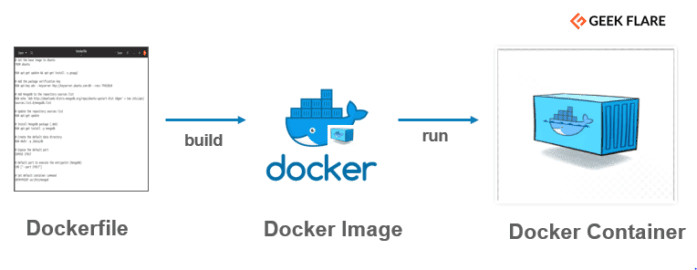
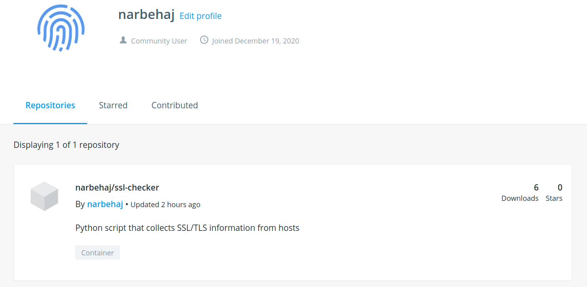

# Create a Docker image for a Python app and push it to the registry


While ago I was developing [SSL Checker](https://github.com/narbehaj/ssl-checker) python script o check hosts’ SSL/TLS certificates and extract useful information about them. Check the script on [GitHub page](https://github.com/narbehaj/ssl-checker) to figure out more about this. After various adjustments and  enhancements, I chose to start a Docker image as well. It’s much more  comfortable to build or pull from the registry and run on environments  rather than cloning.


### The Dockerfile

Dockerfile is an effortless way to  instruct Docker how you need or want to make your container’s image to  be like. There are millions of images available online for any project,  you can create your own image too for the sake of simplicity while in  the development environment.



For the project that I own, I need a  base image to start building my components on. Just think of an  application that is required to be built on an operating system,  including the dependencies and required packages and modules.


### Build an image from the Dockerfile

One of the major positiveness of the  Dockerfile is that you can use any images out there to be your base  image. While my project is in python, I need to have it’s packaged to be installed in the image, so what should I use?

The simple answer is `python:3.8` base image (ignore the tag at this moment, you might want to use other tags.)

But there is an issue with a very minimal python script, and it’s the size of the created image with `python:3.8` base image. Let’s try:

```
FROM python:3.8
COPY requirements.txt /
RUN pip install --no-cache-dir -r /requirements.txt
COPY . .
ENTRYPOINT ["python", "/ssl_checker.py"]
```

After building this Dockerfile, you can see a very huge image size after the built:

```
$ cd ssl-checker
$ docker build -t ssl-checker .
$ docker images
REPOSITORY                           TAG                 IMAGE ID            CREATED             SIZE
ssl-checker                          latest              31d57c8ef4cd        12 seconds ago      903MB
```

900MB for a small python project? This is because the `python:3.8` image has a lot more things that we don’t need for this project.


### Minimal base image

I tried `python:3.8-slim` and `python:3.8-alpine` images and they are both fine for the minimal build. There are a couple of things to consider while using these images and those are the base  packages that are required for the script to run. Let’s check the  following new Dockerfile with `python:3.8-slim`:

```
FROM python:3.8-slim
COPY requirements.txt /
RUN apt-get update 
    && apt-get install -y --no-install-recommends gcc 
    && rm -rf /var/lib/apt/lists/* 
    && pip install --no-cache-dir -r /requirements.txt 
    && apt-get purge -y --auto-remove gcc
COPY . .
ENTRYPOINT ["python", "/ssl_checker.py"]
```

The reason why I put `apt-get purge -y --auto-remove gcc` is that I want to keep the image size as lowest possible. Let’s run the build:

```
$ docker build -t ssl-alpine .
$ docker images
REPOSITORY                           TAG                 IMAGE ID            CREATED             SIZE
ssl-alpine                           latest              05e74af24074        8 seconds ago       135MB
```

Cool! It’s now 135MB. Put your comments if you have any other solutions for this to make this even smaller.


### Push to registry

Registries are places to push and store  the images after building. I want to use Docker Hub which is well-known  for all and also free to use. There are plenty of open-source projects  which are self-hosted that you can deploy on your server like [Harbor](https://goharbor.io/).


Let’s start pushing our built image to the Docker Hub registry:

1- Create an account on Docker Hub

2- Login to the Docker Hub via this command:

```
$ docker login --username=[USERNAME]
```

3- Tag your newly built image:

```
$ docker tag [IMAGE_ID] [USERNAME]/[NAME_OF_IMAGE]
```

4- Push it to the registry:

```
$ docker push [USERNAME]/[NAME_OF_IMAGE] 
```


Now, let me do the steps for myself:

```
$ docker login --username=narbehaj 
Password: 
WARNING! Your password will be stored unencrypted in /root/.docker/config.json.
Configure a credential helper to remove this warning. See
https://docs.docker.com/engine/reference/commandline/login/#credentials-store
Login Succeeded
$ docker tag 8339e75f3f38 narbehaj/ssl-checker
$ docker push narbehaj/ssl-checker
The push refers to repository [docker.io/narbehaj/ssl-checker]
06ad836ee9e2: Pushed 
816f9c3da067: Pushed 
4ee765f675d5: Pushed 
a7da5cd8716e: Mounted from library/python 
c30f2ad0f64e: Mounted from library/python 
791e411423ea: Mounted from library/python 
b986ceddf07c: Mounted from library/python 
87c8a1d8f54f: Mounted from library/python 
```


Now go to your profile in Docker Hub, you will see the newly pushed image.



It’s now easy for anyone to pull the image by running the following command:

```
$ docker run -it --rm narbehaj/ssl-checker -H twitter.com
```