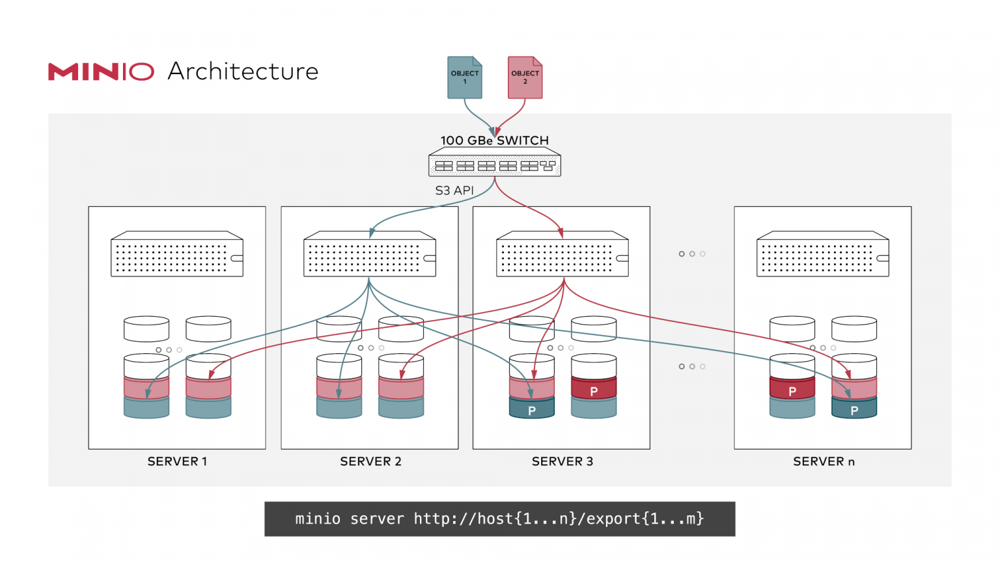
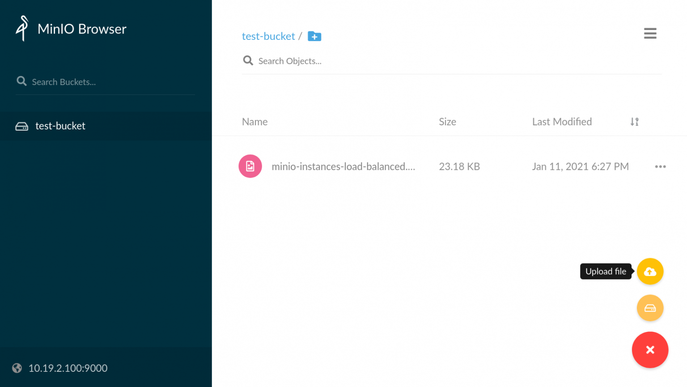

# Deploying Your Own Distributed Object Storage Cluster With MinIO


Despite Ceph, I like [MinIO](https://min.io/) more, it’s so easy to use and easy to deploy. Even the clustering is  with just a command. I used Ceph already and it’s so robust and powerful but for small and mid-range development environments, you might need to set up a full-packaged object storage service to use S3-like commands  and services.

MinIO is super fast and easy to use. You can deploy the service on your servers, Docker and Kubernetes. Let’s  start deploying our distributed cluster in two ways:

1- Installing distributed MinIO directly

2- Installing distributed MinIO on Docker

Before starting, remember that the Access key and Secret key should be identical on all nodes.


### 1- Installing distributed MinIO directly

I have 3 nodes. It is possible to attach extra disks to your nodes to have much better results in performance  and HA if the disks fail, other disks can take place. Something like  RAID or attached SAN storage. But for this tutorial, I will use the  server’s disk and create directories to simulate the disks.

**Since we are going to deploy the distributed service of MinIO, all the data will be synced on other nodes as well.** 



Let’s download the `minio` executable file **on all nodes**:

```
$ wget https://dl.min.io/server/minio/release/linux-amd64/minio
$ chmod +x minio
```

Now if you run the below command, MinIO will run the server in a single instance, serving the `/mnt/data` directory as your storage:

```
$ MINIO_ACCESS_KEY=minioadmin MINIO_SECRET_KEY=minioadmin ./minio server /mnt/data
```

But here we are going to run it in  distributed mode, so let’s create two directories on all nodes which  simulate two disks on the server:

```
$ mkdir /media/minio1/ /media/minio2/
```

Now let’s run the MinIO, notifying the  service to check other nodes’ state as well, we will specify other  nodes’ corresponding disk path too, which here all are `/media/minio1` and `/media/minio2`. Run the below command on all nodes:

```
$ MINIO_ACCESS_KEY=minioadmin MINIO_SECRET_KEY=minioadmin
$ ./minio server http://10.19.2.{100,101,102}/minio{1..2}
```

Here you can see that I used {100,101,102} and {1..2}, if you run this command, the shell will interpret it as follows:

```
$ echo http://10.19.2.{100,101,102}/minio{1..2}
http://10.19.2.100/minio1 http://10.19.2.100/minio2 http://10.19.2.101/minio1 http://10.19.2.101/minio2 http://10.19.2.102/minio1 http://10.19.2.102/minio2
```

This means that I asked MinIO to connect to all nodes (if you have other nodes, you can add) and asked the  service to connect their path too. Then you will see an output like  this:

```
Waiting for all MinIO sub-systems to be initialized.. trying to acquire lock
Waiting for all MinIO sub-systems to be initialized.. lock acquired
All MinIO sub-systems initialized successfully
Status:         6 Online, 0 Offline. 
Endpoint: http://10.19.2.102:9000 http://127.0.0.1:9000           
RootUser: minioadmin 
RootPass: minioadmin
```

Now open your browser and point one of the nodes’ IP address on port 9000. ex: **http://10.19.2.101:9000**

No matter where you log in, the data  will be synced, better to use a reverse proxy server for the servers,  I’ll use Nginx at the end of this tutorial.


### 2- Installing distributed MinIO on Docker

For Docker deployment, we now know how  it works from the first step. The same procedure fits here. The only  thing that we do is to use the `minio` executable file in Docker. So as in the first step, we already have the directories or the disks we need.

```
$ docker run -p 9000:9000 -e MINIO_ACCESS_KEY=minioadmin -e MINIO_SECRET_KEY=minioadmin --net=host -v /media/minio1:/minio1 -v /media/minio2:/minio2 minio/minio server http://10.19.2.{100,101,102}/minio{1..2}
```

**NOTE:** I used `--net=host` here because without this argument, I faced the following error which  means that Docker containers cannot see each other from the nodes:

```
Unable to read 'format.json' from http://10.19.2.101:9000/minio1: Post http://10.19.2.101:9000/minio1/readall?disk-id=&file-path=format.json&volume=.minio.sys
```

So after this, fire up the browser and open one of the IPs on port 9000.


The cool thing here is that if one of  the nodes goes down, the rest will serve the cluster. Nginx will cover  the load balancing and you will talk to a single node for the  connections. You can use other proxies too, such as HAProxy.

Here is the config file, it’s all up to you if you want to configure the Nginx on docker or you already have the server:

```
user  nginx;
worker_processes  auto;

error_log  /var/log/nginx/error.log warn;
pid        /var/run/nginx.pid;

events {
    worker_connections  1024;
}

http {
    include       /etc/nginx/mime.types;
    default_type  application/octet-stream;
    log_format  main  '$remote_addr - $remote_user [$time_local] "$request" '
                      '$status $body_bytes_sent "$http_referer" '
                      '"$http_user_agent" "$http_x_forwarded_for"';

    access_log  /var/log/nginx/access.log  main;
    sendfile        on;
    #tcp_nopush     on;
    keepalive_timeout  65;
    #gzip  on;

    # include /etc/nginx/conf.d/*.conf;

    upstream minio {
        server 10.19.2.100:9000;
        server 10.19.2.101:9000;
        server 10.19.2.102:9000;
    }

    server {
        listen       9000;
        listen  [::]:9000;
        server_name  localhost;

         # To allow special characters in headers
         ignore_invalid_headers off;
         # Allow any size file to be uploaded.
         # Set to a value such as 1000m; to restrict file size to a specific value
         client_max_body_size 0;
         # To disable buffering
         proxy_buffering off;

        location / {
            proxy_set_header Host $http_host;
            proxy_set_header X-Real-IP $remote_addr;
            proxy_set_header X-Forwarded-For $proxy_add_x_forwarded_for;
            proxy_set_header X-Forwarded-Proto $scheme;

            proxy_connect_timeout 300;
            # Default is HTTP/1, keepalive is only enabled in HTTP/1.1
            proxy_http_version 1.1;
            proxy_set_header Connection "";
            chunked_transfer_encoding off;

            proxy_pass http://minio;
        }
    }
}
```

What we will have at the end, is a clean and distributed object storage.


