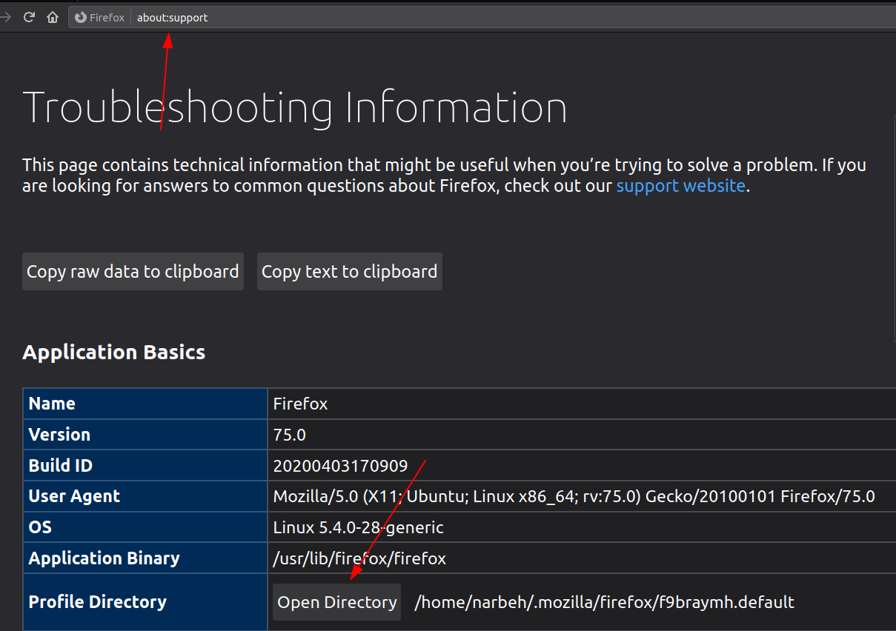
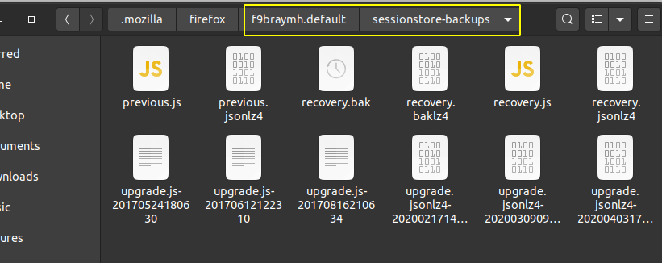
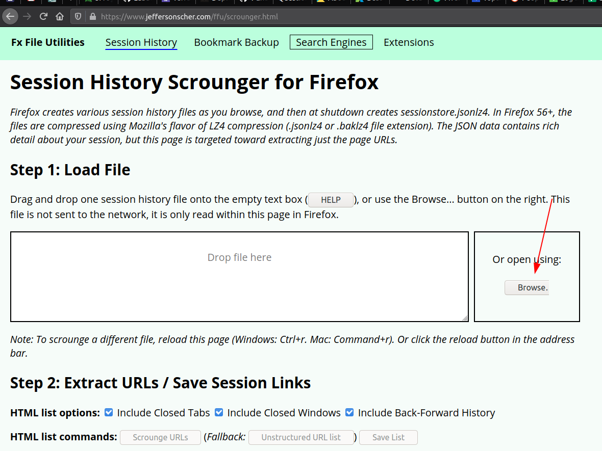

# Help, I lost all pinned and opened tabs in Firefox!

On average, I have 3-4 pinned tabs with nearly 20 opened items. My  Firefox is always up and I never close it except on reboot or such. One  day, I opened a new window in another workspace, then closed the main  window accidentally which included my 1 year opened tabs. What happened  then, I couldn’t restore the previous session which was the recently  opened window so I lost all of them. 

I should’ve sifted through into my history to restore them one-by-one. After exploring the Internet, I figured out that people had  the same problem, and luckily Firefox stores and backs up the session  files.

## Solution: Session History Files

Firefox keeps track of opened tabs and the whole sessions and stores  them in your profile directory. All are in JSON format, compressed and  you can use them for restoring.

To access the files, enter `about:support` in the address bar and press enter. Then you will see a button named `Open Directory` or maybe `Open Folder` right beside the `Profile Directory` column. By opening it, you will be directed to your main Firefox directory.

Right there, you will see a directory named `sessionstore-backups` which contains your session files.

There are a couple of files here which are:

- **upgrade\*** files contain the session history after an upgrade
- **recovery\*** files contain the current session
- **previous\*** files contain the old sessions after closing the Firefox (You need this)

These are all compressed with LZ4 method and you need a tool for that. There is a website for doing this. Go to [Scrounger tool](https://www.jeffersonscher.com/res/scrounger.html) and upload your `previous.jsonlz4` file and extract the tabs.

